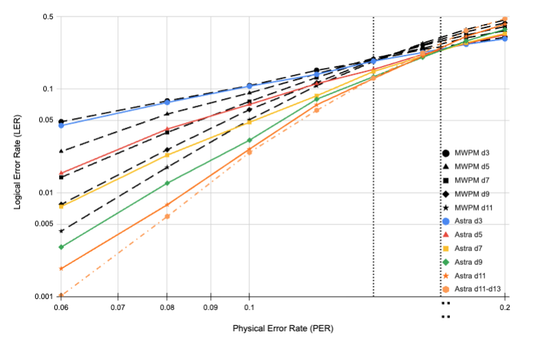

# Astra: A Graph Neural Network (GNN) Decoder for QLDPC codes

A graph neural network which works on the Tanner graph of the error correcting codes. **Astra** learns to operate the belief-propagation algorithm on that graph.

<!Preliminary results of the decoder, when compared against Minimum Weight Perfect Matching (MWPM), for decoding surface codes up to distance 9 affected by code capacity noise.
For the GNN we observe a threshold of 17\%: left) data obtained by numerical simulations; b) curves representing the asymptotes fitted to the numerical data.
>

The plot shows Logical Error Rate (LER) for code capacity depolarising noise of Astra vs MWPM. Astra has a threshold of∼ 17%, and MWPM has a threshold of ∼ 14%. Astra clearly outperforms MWPM in terms of LER. In fact Astra’s d9 is better
than MWPM’s d11.

**Files**
- `gnn_train.py` to train the gnn model
- `gnn_test.py` testing the decoder using the trained gnn model
- `panq_functions` contains the GNN model and all the required functions

**Notes**
- Required Python version == 3.11  
- requirement.txt is for Mac M2  
- models were trained on Float16 precision using Nvidia GPUs

For more details please refer to the paper or feel free to reach out if there are any questions: \
Maan, A.S., Paler, A. Machine learning message-passing for the scalable decoding of QLDPC codes. npj Quantum Inf 11, 78 (2025). https://doi.org/10.1038/s41534-025-01033-w

\
**This research was performed in part with funding from the Defense Advanced Research Projects Agency (under the Quantum Benchmarking (QB) program under award no. HR00112230006 and HR001121S0026 contracts).**
